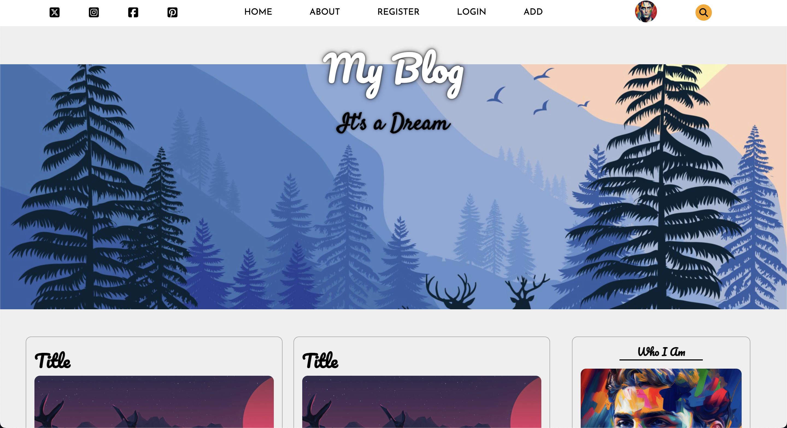
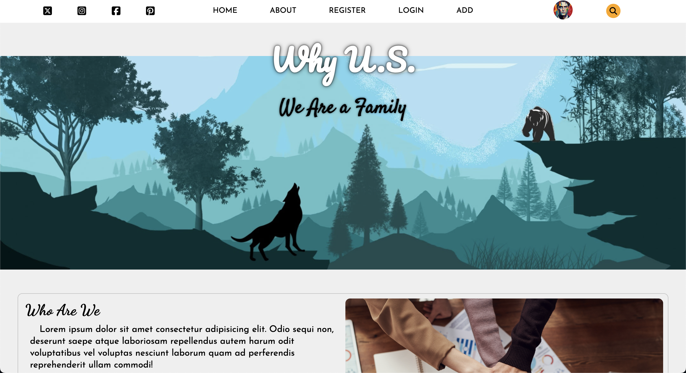
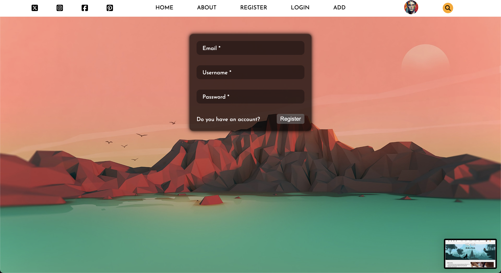
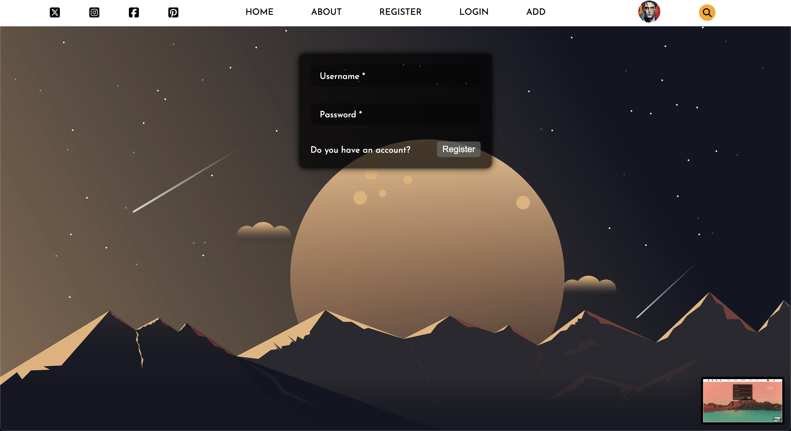
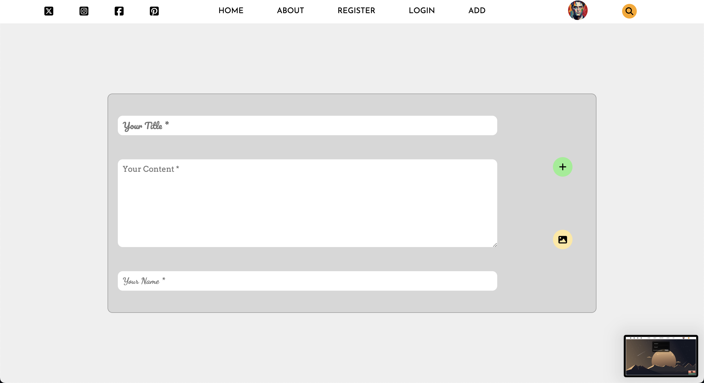
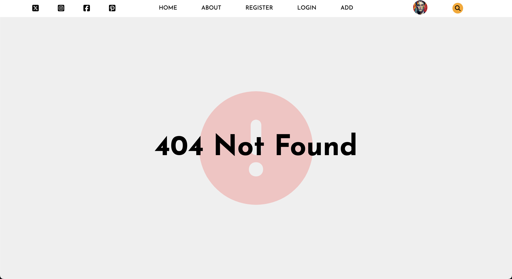

# MyBlog Application

MyBlog is a simple blog application developed using HTML, CSS, and JavaScript. The project includes scroll animations for an interactive experience and features modern typography options. Although not yet fully functional, the project includes templates for multiple pages such as `about`, `login`, `register`, `add`, and `error`.

## Screenshots

## Video gif


### home page



### about page



### register page



### login page



### add page



### error page



## Table of Contents

- [Features](#features)
- [Technologies Used](#technologies-used)
- [Installation](#installation)
- [Usage](#usage)

## Features

- **Scroll Animations**: JavaScript animations activate when scrolling through the page.
- **Font Awesome**: For icons and visual enhancements.
- **Google Fonts**: Utilizes modern fonts to enhance the design.
- **Basic Page Templates**: The following page templates are included (not yet functional):
  - `about`: About page
  - `login`: Login page
  - `register`: Registration page
  - `add`: New post addition page
  - `error`: Error page
- All templates are stored within the `index.html` file.

## Technologies Used

- **HTML**: For the structure of the web pages.
- **CSS**: For styling and layout.
- **JavaScript**: Manages scroll animations.
- **Font Awesome**: For icons.
- **Google Fonts**: For custom font integration.

## Installation

1. Clone this repository to your local machine:
   ```bash
   git clone https://github.com/ozerbaykal/my_blog_html_css_js.git
   ```
2. Open the `index.html` file in your preferred browser to view the project.

## Usage

After opening the project in your browser, scroll down the page to see animations in action. The `about`, `login`, `register`, `add`, and `error` pages are currently inactive and exist as templates within `index.html`.
